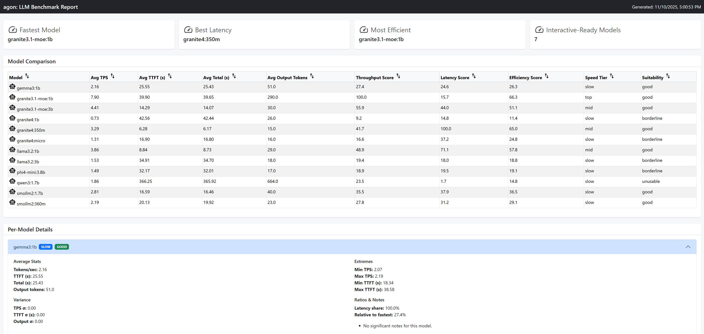

# agon


[](https://pkg.go.dev/github.com/mwiater/agon@v0.2.1)

> **Note:** This is a personal project. I will do my best to keep the main branch functional and up to date with the time I have available.

`agon` is a terminal-first companion for interacting with large language models that expose the llama.cpp OpenAI-compatible API. It helps you browse available hosts, launch an immersive chat session, and keep model inventories aligned across machines, whether you are experimenting locally or coordinating a distributed cluster.

**I created this application in order to compare small LLMs in parallel** (usually between 1b and 3b parameters): I have 4 distinct nodes running llama.cpp on non-gpu SBCs. While speed was never a priority, I needed some questions answered:

* Which small LLMs are most responsive and accurate when using tools through an MCP server?
* Which small LLMs are most efficient **and** accurate?
* Which small LLMs produce consistently valid JSON output when JSON mode is enforced?
* How do different models compare when handing off responses as inputs to the next model in an agentic pipeline flow?

Overall, `agon` was created to efficiently evaluate different scenarios with small LLMs and try to better understand how to make small LLMs work for various home lab projects.

## Requirements
You'll need to set up at least one llama.cpp server that exposes the OpenAI-compatible API. Router mode is recommended if you want model list/load/unload support.

**NOTE: If you are running git bash on windows, you may need to execute: `echo "ConPTY=on" >> ~/.minttyrc` if the CLI interactivity is not loading or not responsive.**

## Table of Contents

*   [Requirements](#requirements)
*   [Example Setup](#example-setup)
*   [Introduction & Features](#introduction--features)
*   [Installation](#installation)
*   [Configuration](#configuration)
*   [Operating Modes](#operating-modes)
*   [Pipeline Mode (doc)](PIPLINEMODE.md)
*   [Benchmarking (doc)](BENCHMARKING.md)
*   [Accuracy (doc)](ACCURACY.md)
*   [Metrics](#metrics)
*   [CLI Commands](#cli-commands)
*   [Examples](#examples)
*   [MCP Mode (doc)](MCPMODE.md)
*   [Building](#building)
*   [golangci-lint](#golangci-lint)
*   [Testing](#testing)
*   [License](#license)

## Example Setup

I had an unused cluster of 4 Udoo x86 Ultra SBCs. I was curious about experimenting with non-GPU hardware to run inferences in my home network. Since speed is not an option in this setup, these nodes are specifically for generating data in the background throughout the day. For example:

* Random data for fuzz tests
* Fetch and evaluate the current weather and traffic via an MCP server for my home dashboard
* Generate -> Format -> Expand -> Validate data in a pipeline of models

I have several models available on each of my 4 llama.cpp nodes: `agon list models`

```
LlamaCpp01:
  >>>  embeddinggemma:300m
  >>>  qwen3:1.7b
  >>>  smollm2:1.7b
  >>>  smollm2:360m
  >>>  phi4mini:3.8b
  >>>  llama3.2:1b
  >>>  granite3.1moe:1b
  >>>  deepseekr1:1.5b
  >>>  gemma3:1b
  >>>  granite3.1moe:3b
  >>>  granite4:micro
  >>>  granite4:1b
  >>>  granite4:350m
  >>>  llama3.2:3b

LlamaCpp02:
  >>>  embeddinggemma:300m
  >>>  qwen3:1.7b
  >>>  smollm2:1.7b
  >>>  smollm2:360m
  >>>  phi4mini:3.8b
  >>>  llama3.2:1b
  >>>  granite3.1moe:1b
  >>>  deepseekr1:1.5b
  >>>  granite3.1moe:3b
  >>>  gemma3:1b
  >>>  granite4:1b
  >>>  granite4:micro
  >>>  granite4:350m
  >>>  llama3.2:3b

...

```

These become the host/models to select from when running a chat in `multimodelMode`:


## Introduction & Features

*   **Multi-Host Management**: Centralize connection details for any number of llama.cpp hosts in a single configuration file.
*   **Interactive Chat**: A focused, terminal-based UI for conversational AI, with support for single-model, multi-model, and pipeline modes.
*   **Multimodel Chat Mode**: Compare up to four models side-by-side in a single chat interface to evaluate their responses to the same prompt.
*   **Pipeline Mode**: Chain up to four models together in a sequence, where the output of one stage becomes the input for the next.
*   **Accuracy Batch**: Run a prompt suite against each model and log per-prompt correctness via `agon benchmark accuracy`.
*   **MCPMode**: Enables advanced functionality like tool usage by proxying requests through a local `agon-mcp` server.
*   **Comprehensive Model Management**: A suite of commands to `list` and `unload` models across all configured hosts, with `pull`, `delete`, and `sync` available for llama.cpp hosts running in router mode.
*   **Detailed Configuration**: Fine-tune model parameters, system prompts, and application behavior through a simple JSON configuration.
*   **Debug & Performance Instrumentation**: Surface detailed timing and token metrics in the UI and log files to understand model performance.

## Installation

### Building

Install GoReleaser: https://goreleaser.com/install/

From the root of the project, run the following command to build the `agon` and `agon-mcp` binaries:

```bash
goreleaser release --snapshot --clean --skip=publish
```

*   `--snapshot`: Creates a local build without requiring a Git tag.
*   `--clean`: Ensures the `dist/` directory is cleared of old artifacts.
*   `--skip=publish`: Prevents any attempt to publish the release to GitHub.

The binaries will be placed in the `dist/` directory, organized by architecture, e.g.:

```
dist/agon_linux_amd64_v1/agon
dist/agon_windows_amd64_v1/agon.exe
dist/agon-mcp_linux_amd64_v1/agon-mcp
dist/agon-mcp_windows_amd64_v1/agon-mcp.exe
```

#### Verifying the Installation

To verify the build, run the `agon` command with the `--version` flag:

```bash
./dist/agon_linux_amd64_v1/agon --version
```

This should print the version of `agon` that you have installed.

## Configuration

`agon` is configured via a JSON file. By default, it looks for `configs/config.json`, but you can specify a different path with the `--config` or `-c` flag.

### Global Settings

*   `timeout`: (Integer) Timeout in seconds for API requests (default: `600`).
*   `debug`: (Boolean) When `true`, enables debug logging to `agon.log` and displays performance metrics in the UI.
*   `multimodelMode`: (Boolean) If `true`, the application starts directly in Multimodel mode.
*   `pipelineMode`: (Boolean) If `true`, the application starts directly in Pipeline mode.
*   `jsonMode`: (Boolean) If `true`, forces the model to respond in JSON format.
*   `logFile`: (String) A file path to write log files to.
*   `mcpRetryCount`: (Integer) The number of times to retry a failed MCP request.

### Host Settings (`hosts` array)

Each object in the `hosts` array defines a host instance:

*   `name`: (String) A friendly name for the host, displayed in the UI.
*   `url`: (String) The base URL of the API endpoint (e.g., `http://localhost:11434`).
*   `type`: (String) The type of host. Supported values: `"llama.cpp"` (alias: `"llamacpp"`).
*   `models`: (Array of Strings) A list of model identifiers to manage on this host.
*   `systemPrompt`: (String) A custom system prompt to use for all interactions with this host.
*   `parameterTemplate`: (String) Required parameter preset to apply before overrides. Supported: `generic`, `fact_checker`, `creative`.
*   `parameters`: (Object) A key-value map of model parameters to control generation. Parameter support varies by llama.cpp build and model.
    *   Common keys: `temperature`, `top_k`, `top_p`, `min_p`, `typical_p`, `repeat_last_n`, `repeat_penalty`, `presence_penalty`, `frequency_penalty`, `n_predict`, `n_probs`.

### Host Compatibility Matrix

*   **llama.cpp**: model list/load/unload via router mode, chat via OpenAI-compatible endpoints, JSON mode (`response_format`). Tool-call forwarding is in progress and requires a server that supports OpenAI tool calls.

### MCP Mode Settings

*   `mcpMode`: (Boolean) If `true`, enables the MCPmode.
*   `mcpBinary`: (String) The path to the `agon-mcp` server binary (default: `dist/agon-mcp`).
*   `mcpInitTimeout`: (Integer) Timeout in seconds for MCP server initialization.

### Example Configurations

For example configurations, see the `configs/` directory. Each file demonstrates a different mode or feature:

*   `config.example.JSONMode.json`: An example of how to set up JSON mode.
*   `config.example.MCPMode.json`: An example of how to set up MCP mode.
*   `config.example.ModelParameters.json`: An example of how to set up model parameters.
*   `config.example.PipelineMode.json`: An example of how to set up Pipeline mode (see [PIPLINEMODE.md](PIPLINEMODE.md)).
*   `config.example.LlamaCpp.json`: An example of how to set up llama.cpp router mode.
*   `scripts/llamacpp_integration_check.go`: A quick integration check to inspect `/models` and probe accepted chat parameters on a llama.cpp endpoint.

## Operating Modes

### Singlemodel Mode

This is the standard, default mode for `agon`, providing a classic, one-on-one chat session with a single language model. It works by having you first select a host and then a model to interact with. The user interface is a clean, scrollable conversation history, focusing on a direct and uninterrupted dialogue. This mode differs from others by its simplicity and focus on a single line of conversation, whereas Multimodel mode orchestrates multiple models. It is most useful for direct, focused tasks, creative writing, or any scenario where you want a traditional chatbot experience without the complexity of multiple models. Single-Model mode can be combined with `JSONMode` to enforce structured output and `MCPMode` to enable tool use (see [MCPMODE.md](MCPMODE.md)).


> In Single-model mode, model parameters will also be shown since there is more UI real estate. These values will be set from the "parameters" settings in the config files. See: [configs/config.example.ModelParameters.json](configs/config.example.ModelParameters.json)

### Multimodel Mode

Multimodel mode is a powerful feature for comparative analysis, allowing you to chat with up to four different language models simultaneously in a side-by-side interface. When you send a prompt, it is dispatched to all assigned models at the same time, and their responses are streamed back into their respective columns. This mode is incredibly useful for comparing the performance, tone, or factual accuracy of different models, A/B testing various system prompts with the same model, or observing how different parameters affect a model's output. Multimodel mode can be run in conjunction with `JSONMode` and `MCPMode` (see [MCPMODE.md](MCPMODE.md)).


> In Multi-model mode, compare up to 4 host/model pairs in parallel.

### Pipeline Mode

Pipeline mode is designed for multi-step workflows by chaining up to four models together in a sequence. The output of one stage becomes the input to the next, enabling progressive refinement such as brainstorm -> outline -> draft -> review. This sequential flow differs from Multimodel mode's parallel comparisons. Pipeline mode can be combined with `JSONMode` and `MCPMode`, and is mutually exclusive with Multimodel mode. For full configuration and export examples, see [PIPLINEMODE.md](PIPLINEMODE.md).


> For full pipeline setup and examples, see [PIPLINEMODE.md](PIPLINEMODE.md).

### JSON Mode

JSON mode is a constraint that can be applied to any of the other operating modes to force the language model to return its response in a valid JSON format. It sends OpenAI-style `response_format: {"type":"json_object"}` and relies on the server to honor it. This differs from other modes as it doesn't change the user interface or workflow but rather dictates the structure of the model's output. This is extremely useful for any task that requires structured data, such as data extraction, classification, or when the output of `agon` is intended to be consumed by another program or script that expects a predictable JSON structure. It can be enabled alongside Single-Model, Multimodel, and MCP modes (see [MCPMODE.md](MCPMODE.md)).


> In JSON mode, force model output to be in JSON format. This is exactly why I developed agon. As you can see above, some models perform better at this task than others. See: [configs/config.example.JSONMode.json](configs/config.example.JSONMode.json)

### MCP Mode


MCP mode is an advanced feature that enables language models to use external tools by proxying requests through a local `agon-mcp` server process. When enabled, `agon` starts and manages this server in the background. If the language model determines that a user's request can be fulfilled by one of the available tools (like fetching the current weather), it can issue a `tool_calls` request. `agon` intercepts this, executes the tool via the MCP server, and feeds the result back to the model to formulate a final answer. This mode is not a distinct UI but rather a capability that enhances other modes by giving them access to real-time information or other external actions. It is useful for breaking the model out of its static knowledge base and allowing it to interact with the outside world. MCP mode can be used in combination with Single-Model, Multimodel, and Pipeline modes, as well as `JSONMode`. Tool-call forwarding requires llama.cpp OpenAI-compatible tool calls and is in progress.


> In MCP mode, test how different models work with tool calls. See: [configs/config.example.MCPMode.json](configs/config.example.MCPMode.json)

=======
## Metrics

### General Operating Metrics

If `metrics: true` in a config file you run, all response metrics are aggregated and saved in: `agonData/modelMetrics/model_performance_metrics.json`. This way, over time, as you use the tool, model metrics are captured under different scenarios, hopefully giving some long-term insights on models over time. I have `metrics: true` in all of my configs in order to collect this data over time for a different perspective on model metrics.

### Benchmarking

Benchmarking is a command-driven workflow that runs technical benchmarks directly against llama.cpp to compare response timing and stability. Use `agon benchmark` to run benchmarks and collect results in `agonData/modelBenchmarks/`. For setup and example commands, see [BENCHMARKING.md](BENCHMARKING.md).

### Accuracy

Accuracy is a command-driven batch process that runs a prompt suite against each model and logs per-prompt correctness. The prompts live in `internal/accuracy/accuracy_prompts.json`. Use `agon run accuracy` to generate results in `agonData/modelAccuracy/` after you have fetched model metadata. For prerequisites and examples, see [ACCURACY.md](ACCURACY.md).

You can run: `agon analyze metrics` after completing benchmarks and accuracy batches. It outputs a standalone HTML file (`agonData/reports/metrics-report.<parameterTemplate>_profile.html`) containing model metric details, comparison leaderboard, and recommendations. The `<parameterTemplate>` value comes from the accuracy JSONL data generated during `agon run accuracy`:

You can run: `agon analyze metrics` which will output a standalone html file (`agonData/reports/metrics-report.<parameterTemplate>_profile.html`) containing model metric details, comparison leaderboard, and recommendations. The `<parameterTemplate>` value comes from the accuracy JSONL data generated during `agon benchmark accuracy`:



### Analyze Metrics

`agon analyze metrics` relies on previously collected data. Run these steps first:

1. `agon fetch modelmetadata --endpoints http://localhost:8080,http://localhost:8081 --gpu radeon-rx-570` to populate `agonData/modelMetadata/`.
2. `agon benchmark models --config configs/config.json` to generate benchmark JSON in `agonData/modelBenchmarks/`.
3. `agon benchmark accuracy` to generate accuracy JSONL in `agonData/modelAccuracy/`.

Once those are available, run:

```bash
agon analyze metrics
```

## CLI Commands

### `agon chat`

Starts the main interactive chat UI. The UI mode is determined by the configuration file or command-line flags.

*   **Flags**:
    *   `--config, -c`: Path to a custom config file.
    *   `--multimodelMode`: Override config to start in Multimodel mode.
    *   `--pipelineMode`: Override config to start in Pipeline mode.
    *   `--debug`, `--jsonMode`, `--mcpMode`, etc.

*   **Examples**:
    *   Start a chat session with the default configuration:
        ```bash
        agon chat
        ```
    *   Start a chat session in Multimodel mode:
        ```bash
        agon chat --multimodelMode
        ```
    *   Start a chat session with a custom configuration file:
        ```bash
        agon chat --config /path/to/your/config.json
        ```

### `agon list`

*   **`agon list models`**: Lists all models specified in the config for each host and indicates if they are available on the host machine.
*   **`agon list commands`**: Lists all available commands.

### `agon pull`

*   **`agon pull models`**: Pulls any models from your config that are missing on the respective llama.cpp hosts (router mode required).

**Example**
```bash
agon pull models --config configs/config.example.LlamaCpp.json
```

### `agon delete`

*   **`agon delete models`**: Deletes specified models from their llama.cpp hosts (router mode required).

**Example**
```bash
agon delete models --config configs/config.example.LlamaCpp.json
```

### `agon sync`

*   **`agon sync models`**: Synchronizes each llama.cpp host to have exactly the models listed in the config (router mode required).

**Example**
```bash
agon sync models --config configs/config.example.LlamaCpp.json
```

*   **`agon sync configs`**: Synchronizes per-host config files from the main config.

**Example**
```bash
agon sync configs --config configs/config.json
```

### `agon unload`

*   **`agon unload models`**: Unloads models from memory on their hosts to free up resources.

**Example**
```bash
agon unload models --config configs/config.example.LlamaCpp.json
```

### `agon show`

*   **`agon show config`**: Displays the current, fully resolved configuration.

**Example**
```bash
agon show config --config configs/config.example.LlamaCpp.json
```

### `agon analyze`

*   **`agon analyze metrics`**: Generates metric analysis and an HTML report from benchmark outputs (includes the parameter template name from accuracy results in the report filename).

**Example**
```bash
agon analyze metrics --benchmarks-dir agonData/modelBenchmarks --metadata-dir agonData/modelMetadata
```

### `agon benchmark`

*   **`agon benchmark models`**: Runs benchmarks for models defined in the config file.
*   **`agon benchmark model`**: Runs a single benchmark against a benchmark server endpoint.
*   **`agon benchmark accuracy`**: Runs the accuracy batch workflow. Uses the prompt suite in `internal/accuracy/accuracy_prompts.json`, reads `agonData/modelMetadata/` (use `agon fetch modelmetadata`), and appends results to `agonData/modelAccuracy/`. Defaults to the `accuracy` parameter template unless overridden.

**Examples**
```bash
agon benchmark models --config configs/config.json
```

```bash
agon benchmark model --model llama-3-2-1b-instruct-q8_0.gguf --gpu radeon-rx-570 --benchmark-endpoint http://localhost:9999/benchmark
```

```bash
agon benchmark accuracy
```

```bash
agon benchmark accuracy --parameterTemplate fact_checker
```

### `agon fetch`

*   **`agon fetch modelmetadata`**: Fetches model metadata from configured hosts.

**Example**
```bash
agon fetch modelmetadata --endpoints http://localhost:8080,http://localhost:8081 --gpu radeon-rx-570
```

### `agon list`

*   **`agon list commands`**: Lists all available commands.

**Examples**
```bash
agon list commands
```


### `agon rag`

*   **`agon rag index`**: Builds the RAG JSONL index.
*   **`agon rag preview`**: Previews RAG retrieval and context assembly.

**Examples**
```bash
agon rag index --config configs/config.example.RAGAccuracy.json
```

```bash
agon rag preview "what is agon?" --config configs/config.example.RAGAccuracy.json
```

## Examples

### Simple Chat Session

1.  **Create a configuration file** (`configs/config.json`):

    ```json
    {
      "hosts": [
        {
          "name": "LlamaCpp01",
          "url": "http://192.168.0.101:8080",
          "type": "llama.cpp",
          "models": [
            "qwen3:1.7b",
            "llama3.2:1b",
            "smollm2:1.7b",
            "granite3.1moe:1b"
          ],
          "systemprompt": "You are a helpful and concise assistant.",
          "parameterTemplate": "generic"
        },
        {
          "name": "LlamaCpp02",
          "url": "http://192.168.0.102:8080",
          "type": "llama.cpp",
          "models": [
            "qwen3:1.7b",
            "llama3.2:1b",
            "smollm2:1.7b",
            "granite3.1moe:1b"
          ],
          "systemprompt": "You are a helpful and concise assistant.",
          "parameterTemplate": "generic"
        }
      ]
    }
    ```

2.  **Start `agon`**:

    ```bash
    agon chat
    ```

### Multimodel Chat Session

1.  **Create a configuration file** (`configs/config.json`):

    ```json
    {
      "hosts": [
        {
          "name": "LlamaCpp01",
          "url": "http://192.168.0.101:8080",
          "type": "llama.cpp",
          "models": [
            "qwen3:1.7b",
            "llama3.2:1b",
            "smollm2:1.7b",
            "granite3.1moe:1b"
          ],
          "systemprompt": "You are a helpful and concise assistant."
        },
        {
          "name": "LlamaCpp02",
          "url": "http://192.168.0.102:8080",
          "type": "llama.cpp",
          "models": [
            "qwen3:1.7b",
            "llama3.2:1b",
            "smollm2:1.7b",
            "granite3.1moe:1b"
          ],
          "systemprompt": "You are a helpful and concise assistant."
        }
      ],
      "multimodelMode": true
    }
    ```

2.  **Start `agon`**:

    ```bash
    agon chat
    ```

### JSON Mode

1.  **Create a configuration file** (`configs/config.json`):

    ```json
    {
      "hosts": [
        {
          "name": "LlamaCpp01",
          "url": "http://192.168.0.101:8080",
          "type": "llama.cpp",
          "models": [
            "qwen3:1.7b",
            "llama3.2:1b",
            "smollm2:1.7b",
            "granite3.1moe:1b"
          ],
          "systemprompt": "You are a helpful and concise assistant."
        },
        {
          "name": "LlamaCpp02",
          "url": "http://192.168.0.102:8080",
          "type": "llama.cpp",
          "models": [
            "qwen3:1.7b",
            "llama3.2:1b",
            "smollm2:1.7b",
            "granite3.1moe:1b"
          ],
          "systemprompt": "You are a helpful and concise assistant."
        }
      ],
      "jsonMode": true
    }
    ```

2.  **Start `agon`**:

    ```bash
    agon chat
    ```

### MCP Mode

MCP mode adds tool usage by proxying requests through a local `agon-mcp` server process. When enabled, `agon` starts and manages the server in the background, intercepts `tool_calls`, executes the requested tool, and feeds the results back to the model for a final response. This unlocks real-time information and external actions while keeping the same chat UI, and can be combined with Single-Model, Multimodel, Pipeline, or JSON modes. For setup, tool lists, and examples, see [MCPMODE.md](MCPMODE.md).


> For MCP mode setup and examples, see [MCPMODE.md](MCPMODE.md).

### llama.cpp Router Mode

See [SERVICES.md](SERVICES.md) for router mode setup and examples.

### Exporting Data

For pipeline mode configuration and exports, see [PIPLINEMODE.md](PIPLINEMODE.md).

## Building

### Build Command

From the root of the project, run the following command to build the `agon` and `agon-mcp` binaries:

```bash
goreleaser release --snapshot --clean --skip=publish
```

*   `--snapshot`: Creates a local build without requiring a Git tag.
*   `--clean`: Ensures the `dist/` directory is cleared of old artifacts.
*   `--skip=publish`: Prevents any attempt to publish the release to GitHub.

The binaries will be placed in the `dist/` directory, organized by architecture, e.g.:

```
dist/agon_linux_amd64_v1/agon
dist/agon_windows_amd64_v1/agon.exe
dist/agon-mcp_linux_amd64_v1/agon-mcp
dist/agon-mcp_windows_amd64_v1/agon-mcp.exe
```

## golangci-lint

### Installation

Install the linter with:

```bash
go install github.com/golangci/golangci-lint/cmd/golangci-lint@latest
```

Make sure `$GOPATH/bin` (or `$GOBIN`) is on your `PATH` so `golangci-lint` is available.

### Usage

Run lint checks from the repo root:

```bash
golangci-lint run
```

To focus on a specific package:

```bash
golangci-lint run ./internal/...
```

## Testing

```bash
go clean -testcache
go test ./...
```

To generate a coverage report:

```bash
go clean -testcache
go test ./... -coverprofile=.coverage/coverage.out
go tool cover -func=.coverage/coverage.out
```

## License

This project is distributed under the [MIT License](LICENSE).
