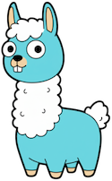

# agon



>**Note:** This is a personal project. I will do my best to keep the main branch functional and up to date with the time I have available.

`agon` is a terminal-first companion for interacting with large language models that expose the Ollama API. It helps you browse available hosts, launch an immersive chat session, and keep model inventories aligned across machines, whether you are experimenting locally or coordinating a distributed cluster.


## Feature Highlights
- **Multiple host management** – Define any number of Ollama hosts in `config/config.json`, switch between them instantly, and keep connection details in one place.
- **Interactive chat interface** – Drive a focused terminal UI for conversational work with the model you select.
- **Multimodel chat mode** – Assign up to four hosts/models at once and chat with them side by side in a coordinated layout.
- **Model synchronization** – Use a single command to pull models that are missing from a host and prune those not listed in configuration.
- **Comprehensive model tooling** – List, pull, delete, unload, and otherwise manage models without leaving the CLI.
- **Debug instrumentation** – Surface timing, token counts, and other diagnostics whenever you need deeper performance insight.

#### Multichat Mode

Send the same user prompt to up to 4 different Ollama hosts
* <b>Model Comparison:</b> Set each host to a different model and compare with the same user prompt.
* <b>System Prompt Comparison:</b> Set the host models to the same model, and compare various system prompts with the same user prompt.
<b>Parameter Comparison:</b> Set the host models to the same model and the same system prompt, and compare various model parameter settings.
* <em>Or mix and match!</em>


#### Singlechat Mode

Normal chat mode, displays model information, parameters, and response metrics.


## Requirements
- Go toolchain installed (the project targets recent Go releases).
- Access to one or more running Ollama instances reachable from your terminal.

## Installation

1) Install `goreleaser`: https://goreleaser.com/install/
2) Clone repo: `git clone git@github.com:mwiater/agon.git && cd agon`
3) `go mod tidy`
4) Run goreleaser: `goreleaser release --snapshot --clean --skip=publish`

Depending on your architecture, you'll find builds to run in the `dist/` directory.

OR:

Install the command with `go install`:

```bash
go install github.com/mwiater/agon/cmd/agon@latest
```

The resulting binary will be placed in your Go bin directory (e.g., `$GOPATH/bin`). You will have to create and point to a config file. See `config/` directory for examples

## Configuration
`agon` reads its settings from a JSON document. By default it looks for `config/config.json`; copy `config/config.example.json` to that path and update it with your hosts. Use `--config` to point at another file if needed.

Example with custom config: `agon --config config/config.Authors.json`

### Example config structure

See other examples in `configs/`

```json
{
  "hosts": [
    {
      "name": "Ollama01",
      "url": "http://192.168.0.11:11434",
      "type": "ollama",
      "models": [
        "stablelm-zephyr:3b",
        "granite4:micro",
        "gemma3n:e2b",
        "gemma3:270m",
        "deepseek-r1:1.5b",
        "llama3.2:1b",
        "granite3.1-moe:1b",
        "dolphin-phi:2.7b",
        "qwen3:1.7b"
      ],
      "systemprompt": "You are a helpful and concise assistant. Answer questions directly, and be brief and precise. Get straight to the point.",
      "parameters": {
        "top_k": 40,
        "top_p": 0.9,
        "min_p": 0.05,
        "tfs_z": 1.0,
        "typical_p": 0.95,
        "repeat_last_n": 64,
        "temperature": 0.7,
        "repeat_penalty": 1.1,
        "presence_penalty": 0.6,
        "frequency_penalty": 0.3
      }
    },
    {
      "name": "Ollama02",
      "url": "http://192.168.0.12:11434",
      "type": "ollama",
      "models": [
        "deepseek-r1:1.5b",
        "dolphin-phi:2.7b",
        "qwen3:1.7b"
      ],
      "systemprompt": "You are a helpful and concise assistant. Answer questions directly, and be brief and precise. Get straight to the point."
    }
  ],
  "timeout": 120,
  "debug": true,
  "multimodelMode": true,
  "jsonMode": false
}
```

### Configuration Reference
- `hosts`: Array of host definitions (Ollama is the currently supported type).
  - `name`: A friendly label shown in the UI (e.g., `"Local Ollama"`).
  - `url`: Base URL of the Ollama API endpoint (`http://host:11434`).
  - `type`: Host backend identifier (`"ollama"`).
  - `models`: Desired model identifiers to monitor on the host.
  - `systemprompt`: Optional system prompt string. Leave empty to use the model default.
- `debug`: Boolean flag. When `true`, timing/token metrics are shown and `debug.log` captures detailed traces.
- `multimodelMode`: Boolean flag. When `true`, the CLI launches directly into the multimodel chat interface.
- `jsonMode`: Boolean flag. When `true`, the CLI forces the LLM to respond in JSON format.
- `timeout`: Integer (seconds). Sets the request timeout applied to Ollama API calls (default: 120).

## Running the CLI

### Launch an Interactive Chat
Start a session with:

```bash
agon chat
```

- If `multimodelMode` is `false`, the app opens in host selection mode. Pick a host, choose a loaded model (or request a load), and begin chatting in a scrollable viewport.
- If `multimodelMode` is `true`, the assignment view appears. Map hosts to columns, confirm your selections, and converse with multiple models concurrently.

### Available Flags

Use these boolean flags to override the yaml settings in a specific session, e.g.:

* --debug=false
* --multimodelMode=false
* --jsonMode=true

### Model Management Commands
Manage the models across your hosts with dedicated subcommands as defined in your config. Each host can have different models that serve as a source of truth. Running these commands will configure your hosts by pulling, deleting, syncing, and listing the models on each host.

- List models available on the configured hosts:
  ```bash
  agon list models
  ```
- Pull models that are missing locally:
  ```bash
  agon pull models
  ```
- Delete models that you no longer need:
  ```bash
  agon delete models
  ```
- Synchronize hosts with the exact model inventory in `config/config.json` (or your custom config):
  ```bash
  agon sync models
  ```
- Unload models from memory without deleting the artifacts:
  ```bash
  agon unload models
  ```

### Keyboard Shortcuts (Chat Interface)
- `esc` or `Ctrl+c`: Quit the application.
- `Tab`: Return from the chat view to host/model selection.

## Debug Mode Details
With `debug` enabled in configuration, the chat interface displays:
- **Model load duration** – Time required to bring the model into memory.
- **Prompt eval duration/tokens** – Latency and token count for prompt processing.
- **Response eval duration/tokens** – Latency and tokens consumed during generation.
- **Total duration** – End-to-end latency from request to final token.

Each run also appends to `debug.log`, providing a persistent trace for troubleshooting.

## Building From Source
GoReleaser powers both local test builds and tagged GitHub releases. Start your prereleases at `v0.1.0` and increment as you iterate.

### Local snapshot build (no publish)
Run the build locally without touching GitHub:

```bash
goreleaser release --snapshot --clean --skip=publish
```

`snapshot` turns on timestamped versions, `--clean` clears `dist/`, and `--skip=publish` prevents any GitHub release/upload steps.

Create and push a version tag first (for example `git tag -a v0.1.0 -m "v0.1.0" && git push origin v0.1.0`), then run GoReleaser with a token that has `repo` scope. Keep `--clean` so old artifacts are removed before each run.

## Testing
Run the entire suite:

```bash
go test ./...
```

## Coverage Reporting
Produce a coverage profile and summary:

```bash
go clean -testcache
go test ./... -coverprofile=.coverage/coverage.out
go tool cover -func=.coverage/coverage.out
```

## To Do

- [ ] Ensure comment coverage for PKG docs
- [ ] Revisit tests and test coverage
- [ ] UI: Revise multimodel screen to optimize available console real estate.

## License
This project is distributed under the [MIT License](LICENSE).
