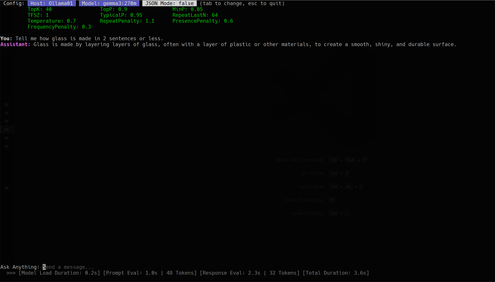
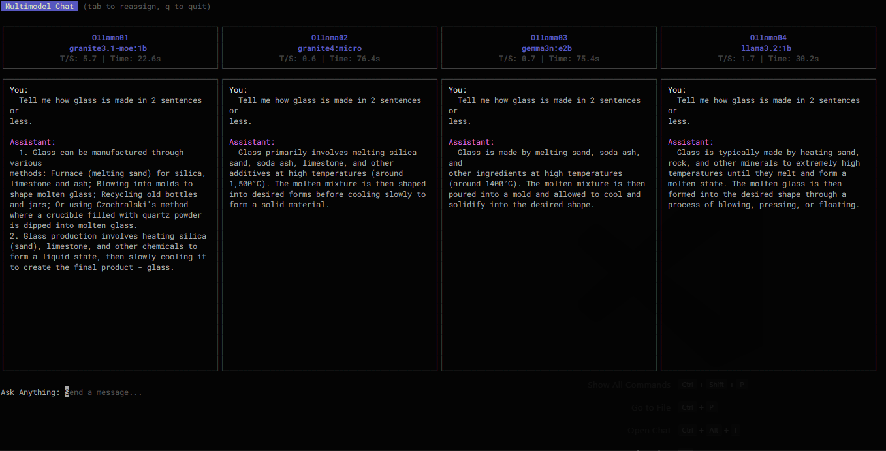

# agon


[](https://pkg.go.dev/github.com/mwiater/agon@v0.2.0)

> **Note:** This is a personal project. I will do my best to keep the main branch functional and up to date with the time I have available.

`agon` is a terminal-first companion for interacting with large language models that expose the Ollama API. It helps you browse available hosts, launch an immersive chat session, and keep model inventories aligned across machines, whether you are experimenting locally or coordinating a distributed cluster.

**I created this application in order to compare small LLMs in parallel** (usually between 1b and 3b parameters): I have 4 distinct nodes running Ollama on non-gpu SBCs. While speed was never a priority, I needed some questions answered:

* Which small LLMs are most responsive and accurate when using tools through an MCP server?
* Which small LLMs are most efficient **and** accurate?
* Which small LLMs produce consistently valid JSON output when Ollama's JSON format is set?
* How do different models compare when handing off responses as inputs to the next model in an agentic pipeline flow?

Overall, `agon` was created to efficiently evaluate different scenarios with small LLMs and try to better understand how to make small LLMs work for various home lab projects.


## Table of Contents

*   [Introduction & Features](#introduction--features)
*   [Installation](#installation)
*   [Configuration](#configuration)
*   [Operating Modes](#operating-modes)
*   [CLI Commands](#cli-commands)
*   [Examples](#examples)
*   [MCP (Multi-Chat Provider) Mode](#mcp-multi-chat-provider-mode)
*   [Building from Source](#building-from-source)
*   [Testing](#testing)
*   [License](#license)

## Introduction & Features

*   **Multi-Host Management**: Centralize connection details for any number of Ollama hosts in a single configuration file.
*   **Interactive Chat**: A focused, terminal-based UI for conversational AI, with support for single-model, multi-model, and pipeline modes.
*   **Multimodel Chat Mode**: Compare up to four models side-by-side in a single chat interface to evaluate their responses to the same prompt.
*   **Pipeline Mode**: Chain up to four models together in a sequence, where the output of one stage becomes the input for the next.
*   **Benchmark Mode**: Run a suite of benchmarks against a model to evaluate its performance.
*   **MCP (Multi-Chat Provider) Mode**: Enables advanced functionality like tool usage by proxying requests through a local `agon-mcp` server.
*   **Comprehensive Model Management**: A suite of commands to `list`, `pull`, `delete`, `sync`, and `unload` models across all configured hosts.
*   **Detailed Configuration**: Fine-tune model parameters, system prompts, and application behavior through a simple JSON configuration.
*   **Debug & Performance Instrumentation**: Surface detailed timing and token metrics in the UI and log files to understand model performance.

## Installation

### Pre-built Binaries

The recommended way to install `agon` is to download the latest pre-built binaries from the [GitHub releases page](https://github.com/mwiater/agon/releases).

### Building from Source

The recommended way to install `agon` is with `go install`:

```bash
go install github.com/mwiater/agon/cmd/agon@latest
```

The resulting binary will be placed in your Go bin directory (e.g., `$GOPATH/bin`). You will need to create a configuration file. See the `config/` directory for examples.

For MCP mode, the `agon-mcp` binary must also be installed and available in the system's `PATH`.

### Verifying the Installation

To verify the installation, run the `agon` command with the `--version` flag:

```bash
agon --version
```

This should print the version of `agon` that you have installed.

## Configuration

`agon` is configured via a JSON file. By default, it looks for `config/config.json`, but you can specify a different path with the `--config` or `-c` flag.

### Global Settings

*   `timeout`: (Integer) Timeout in seconds for API requests (default: `600`).
*   `debug`: (Boolean) When `true`, enables debug logging to `agon.log` and displays performance metrics in the UI.
*   `multimodelMode`: (Boolean) If `true`, the application starts directly in Multimodel mode.
*   `pipelineMode`: (Boolean) If `true`, the application starts directly in Pipeline mode.
*   `benchmarkMode`: (Boolean) If `true`, the application starts directly in Benchmark mode.
*   `jsonMode`: (Boolean) If `true`, forces the model to respond in JSON format.
*   `export`: (String) A file path to automatically export pipeline run data as a JSON file.
*   `exportMarkdown`: (String) A file path to automatically export a Markdown summary of pipeline runs.
*   `logFile`: (String) A file path to write log files to.
*   `mcpRetryCount`: (Integer) The number of times to retry a failed MCP request.

### Host Settings (`hosts` array)

Each object in the `hosts` array defines an Ollama instance:

*   `name`: (String) A friendly name for the host, displayed in the UI.
*   `url`: (String) The base URL of the Ollama API endpoint (e.g., `http://localhost:11434`).
*   `type`: (String) The type of host. Currently, only `"ollama"` is supported.
*   `models`: (Array of Strings) A list of model identifiers to manage on this host.
*   `systemPrompt`: (String) A custom system prompt to use for all interactions with this host.
*   `parameters`: (Object) A key-value map of Ollama model parameters to control generation. For a detailed explanation of the model parameters, see the [Ollama documentation](https://github.com/ollama/ollama/blob/main/docs/modelfile.md#valid-parameters-and-values).
    *   `top_k`, `top_p`, `min_p`, `tfs_z`, `typical_p`, `repeat_last_n`, `temperature`, `repeat_penalty`, `presence_penalty`, `frequency_penalty`.

### MCP Mode Settings

*   `mcpMode`: (Boolean) If `true`, enables the Multi-Chat Provider mode.
*   `mcpBinary`: (String) The path to the `agon-mcp` server binary (default: `dist/agon-mcp`).
*   `mcpInitTimeout`: (Integer) Timeout in seconds for MCP server initialization.

### Example Configurations

For example configurations, see the `config/` directory. Each file demonstrates a different mode or feature:

*   `config.example.Authors.json`: An example of how to set up different author personas.
*   `config.example.BenchmarkMode.json`: An example of how to set up Benchmark mode.
*   `config.example.Facts.json`: An example of how to set up facts.
*   `config.example.JSONMode.json`: An example of how to set up JSON mode.
*   `config.example.MCPMode.json`: An example of how to set up MCP mode.
*   `config.example.ModelParameters.json`: An example of how to set up model parameters.
*   `config.example.PipelineMode.json`: An example of how to set up Pipeline mode.
*   `config.example.SystemPromptLength.json`: An example of how to set up a system prompt with a specific length.

## Operating Modes

### Single-Model Mode

This is the standard, default mode for `agon`, providing a classic, one-on-one chat session with a single language model. It works by having you first select a host and then a model to interact with. The user interface is a clean, scrollable conversation history, focusing on a direct and uninterrupted dialogue. This mode differs from others by its simplicity and focus on a single line of conversation, whereas Multimodel and Pipeline modes orchestrate multiple models. It is most useful for direct, focused tasks, creative writing, or any scenario where you want a traditional chatbot experience without the complexity of multiple models. Single-Model mode can be combined with both `JSONMode` to enforce structured output and `MCPMode` to enable tool use.



### Multimodel Mode

Multimodel mode is a powerful feature for comparative analysis, allowing you to chat with up to four different language models simultaneously in a side-by-side interface. When you send a prompt, it is dispatched to all assigned models at the same time, and their responses are streamed back into their respective columns. This parallel processing is the key differentiator from Pipeline mode, which is sequential. This mode is incredibly useful for comparing the performance, tone, or factual accuracy of different models, A/B testing various system prompts with the same model, or observing how different parameters affect a model's output. Multimodel mode is mutually exclusive with Pipeline mode but can be run in conjunction with `JSONMode` and `MCPMode`.



### Pipeline Mode

Pipeline mode is designed for complex, multi-step workflows by chaining up to four models together in a sequence. In this mode, the output from one model (a "stage") is automatically passed as the input to the next, allowing you to build sophisticated processing chains. For example, you could use the first stage to brainstorm ideas, the second to structure them into an outline, the third to write content, and the fourth to proofread it. This sequential execution is the primary difference from Multimodel mode's parallel nature. It is most useful for tasks that can be broken down into discrete steps, such as data transformation, progressive summarization, or creative writing where each stage builds upon the last. Pipeline mode is mutually exclusive with Multimodel mode but can be combined with `JSONMode` and `MCPMode`.

### Benchmark Mode

Benchmark mode is a new feature that allows you to run a suite of benchmarks against a model to evaluate its performance. To use benchmark mode, you must first create a benchmark configuration file. See the `benchmark/` directory for examples.

### JSON Mode

JSON mode is a constraint that can be applied to any of the other operating modes to force the language model to return its response in a valid JSON format. It works by adding a `format: json` parameter to the underlying Ollama API request. This differs from other modes as it doesn't change the user interface or workflow but rather dictates the structure of the model's output. This is extremely useful for any task that requires structured data, such as data extraction, classification, or when the output of `agon` is intended to be consumed by another program or script that expects a predictable JSON structure. It can be enabled alongside Single-Model, Multimodel, Pipeline, and MCP modes.

### MCP (Multi-Chat Provider) Mode

MCP mode is an advanced feature that enables language models to use external tools by proxying requests through a local `agon-mcp` server process. When enabled, `agon` starts and manages this server in the background. If the language model determines that a user's request can be fulfilled by one of the available tools (like fetching the current weather), it can issue a `tool_calls` request. `agon` intercepts this, executes the tool via the MCP server, and feeds the result back to the model to formulate a final answer. This mode is not a distinct UI but rather a capability that enhances other modes by giving them access to real-time information or other external actions. It is useful for breaking the model out of its static knowledge base and allowing it to interact with the outside world. MCP mode can be used in combination with Single-Model, Multimodel, and Pipeline modes, as well as `JSONMode`.

## CLI Commands

### `agon chat`

Starts the main interactive chat UI. The UI mode is determined by the configuration file or command-line flags.

*   **Flags**:
    *   `--config, -c`: Path to a custom config file.
    *   `--multimodelMode`: Override config to start in Multimodel mode.
    *   `--pipelineMode`: Override config to start in Pipeline mode.
    *   `--benchmarkMode`: Override config to start in Benchmark mode.
    *   `--debug`, `--jsonMode`, `--mcpMode`, etc.

*   **Examples**:
    *   Start a chat session with the default configuration:
        ```bash
        agon chat
        ```
    *   Start a chat session in Multimodel mode:
        ```bash
        agon chat --multimodelMode
        ```
    *   Start a chat session with a custom configuration file:
        ```bash
        agon chat --config /path/to/your/config.json
        ```

### `agon list`

*   **`agon list models`**: Lists all models specified in the config for each host and indicates if they are available on the host machine.
*   **`agon list modelparameters`**: Displays the model parameters for each host as defined in the configuration.
*   **`agon list commands`**: Lists all available commands.

### `agon pull`

*   **`agon pull models`**: Pulls any models from your config that are missing on the respective hosts.

### `agon delete`

*   **`agon delete models`**: Deletes specified models from their hosts.

### `agon sync`

*   **`agon sync models`**: Synchronizes each host to have exactly the models listed in the config, pulling missing ones and deleting extra ones.

### `agon unload`

*   **`agon unload models`**: Unloads models from memory on their hosts to free up resources.

### `agon show`

*   **`agon show config`**: Displays the current, fully resolved configuration.

## Examples

### Simple Chat Session

1.  **Create a configuration file** (`config/config.json`):

    ```json
    {
      "hosts": [
        {
          "name": "Local Llama",
          "url": "http://localhost:11434",
          "type": "ollama",
          "models": [
            "llama3.2:3b"
          ],
          "systemprompt": "You are a helpful and concise assistant."
        }
      ]
    }
    ```

2.  **Start `agon`**:

    ```bash
    agon chat
    ```

### Multimodel Chat Session

1.  **Create a configuration file** (`config/config.json`):

    ```json
    {
      "hosts": [
        {
          "name": "Local Llama",
          "url": "http://localhost:11434",
          "type": "ollama",
          "models": [
            "llama3.2:3b",
            "gemma3:270m"
          ]
        }
      ],
      "multimodelMode": true
    }
    ```

2.  **Start `agon`**:

    ```bash
    agon chat
    ```

### JSON Mode

1.  **Create a configuration file** (`config/config.json`):

    ```json
    {
      "hosts": [
        {
          "name": "Local Llama",
          "url": "http://localhost:11434",
          "type": "ollama",
          "models": [
            "llama3.2:3b"
          ]
        }
      ],
      "jsonMode": true
    }
    ```

2.  **Start `agon`**:

    ```bash
    agon chat
    ```

### MCP Mode

1.  **Create a configuration file** (`config/config.json`):

    ```json
    {
      "hosts": [
        {
          "name": "Local Llama",
          "url": "http://localhost:11434",
          "type": "ollama",
          "models": [
            "llama3.2:3b"
          ]
        }
      ],
      "mcpMode": true
    }
    ```

2.  **Start `agon`**:

    ```bash
    agon chat
    ```

### Exporting Data

When using `pipelineMode`, you can export the results of the pipeline to a JSON or Markdown file.

*   `--export`: Path to a JSON file to export the results to.
*   `--exportMarkdown`: Path to a Markdown file to export the results to.

## MCP (Multi-Chat Provider) Mode

MCP mode is an advanced feature that enables language models to use external tools by proxying requests through a local `agon-mcp` server process. When enabled, `agon` starts and manages this server in the background. If the language model determines that a user's request can be fulfilled by one of the available tools (like fetching the current weather), it can issue a `tool_calls` request. `agon` intercepts this, executes the tool via the MCP server, and feeds the result back to the model to formulate a final answer.

### Setup

1.  Install the `agon-mcp` binary and make sure it is available in your system's `PATH`.
2.  Enable MCP mode in your `config.json` file:

    ```json
    {
      "mcpMode": true
    }
    ```

### Available Tools

*   `current_time`: Returns the current time.
*   `current_weather`: Returns the current weather for a given location.

## Building from Source

### Prerequisites

*   Go toolchain installed.
*   [GoReleaser](https://goreleaser.com/install/) installed.

### Build Command

From the root of the project, run the following command to build the `agon` and `agon-mcp` binaries:

```bash
goreleaser release --snapshot --clean --skip=publish
```

*   `--snapshot`: Creates a local build without requiring a Git tag.
*   `--clean`: Ensures the `dist/` directory is cleared of old artifacts.
*   `--skip=publish`: Prevents any attempt to publish the release to GitHub.

The binaries will be placed in the `dist/` directory, organized by architecture.

## Testing

Run the full test suite:

```bash
go test ./...
```

To generate a coverage report:

```bash
go clean -testcache
go test ./... -coverprofile=.coverage/coverage.out
go tool cover -func=.coverage/coverage.out
```

## License

This project is distributed under the [MIT License](LICENSE).