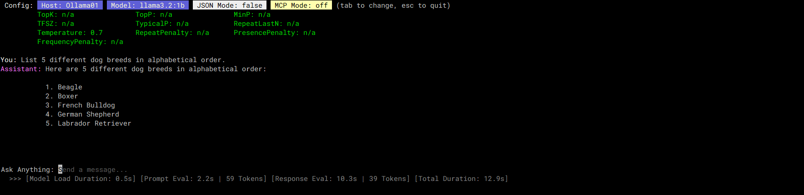
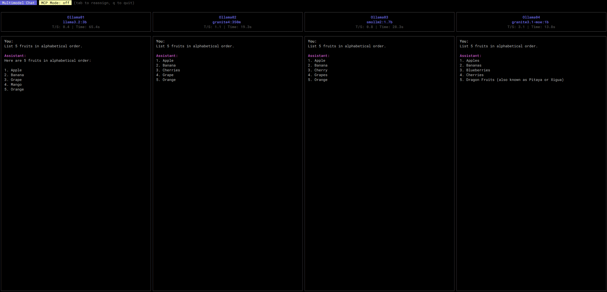
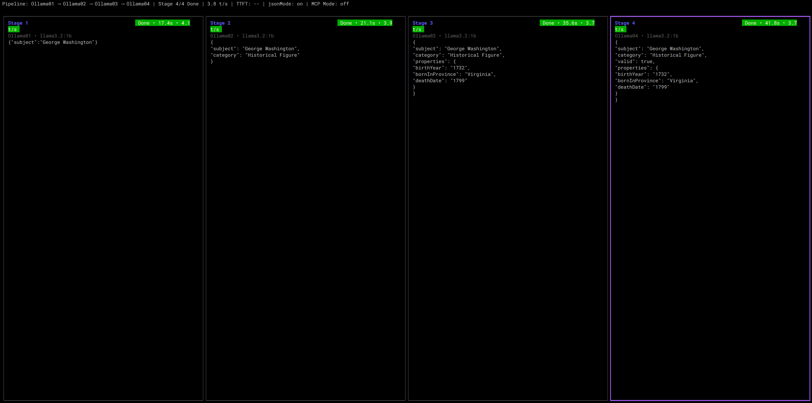
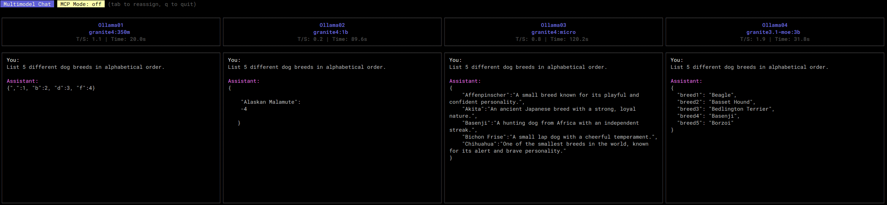
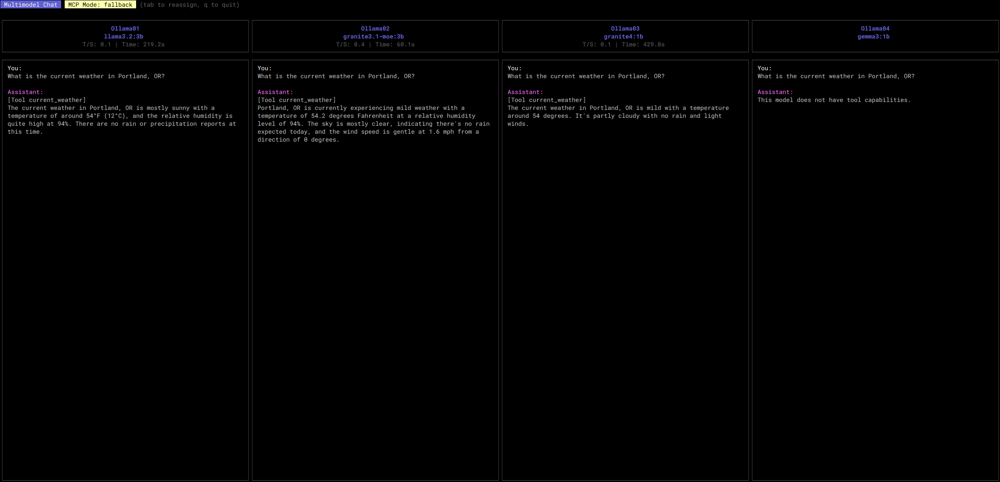

## Operating Modes

## Mode Matrix Checklist (Manual Testing)

This matrix covers the supported chat-mode combinations. `multimodelMode` and `pipelineMode` are mutually exclusive (Singlemodel is the default when both are false). `jsonMode` and `mcpMode` can be layered on top of any chat mode.

| Chat Mode | jsonMode | mcpMode | Notes |
| --- | --- | --- | --- |
| Singlemodel | off | off | Default chat UI. |
| Singlemodel | on | off | JSON output enforced. |
| Singlemodel | off | on | Tool calls via MCP. |
| Singlemodel | on | on | JSON + MCP together. |
| Multimodel | off | off | 2-4 models side-by-side. |
| Multimodel | on | off | JSON output enforced per model. |
| Multimodel | off | on | Tool calls via MCP. |
| Multimodel | on | on | JSON + MCP together. |
| Pipeline | off | off | Sequential model chain. |
| Pipeline | on | off | JSON output enforced per stage. |
| Pipeline | off | on | Tool calls via MCP. |
| Pipeline | on | on | JSON + MCP together. |

RAG mode is not a chat UI mode; it affects the accuracy workflow and RAG utilities. For manual testing, use:
-   `ragMode=false`: baseline accuracy run.
-   `ragMode=true`: accuracy run with retrieval + context injection (requires corpus + index).
-   `agon rag index`: build the RAG index.
-   `agon rag preview`: preview retrieval output.

### Singlemodel Mode

This is the standard, default mode for `agon`, providing a classic, one-on-one chat session with a single language model. It works by having you first select a host and then a model to interact with. The user interface is a clean, scrollable conversation history, focusing on a direct and uninterrupted dialogue. This mode differs from others by its simplicity and focus on a single line of conversation, whereas Multimodel mode orchestrates multiple models. It is most useful for direct, focused tasks, creative writing, or any scenario where you want a traditional chatbot experience without the complexity of multiple models. Single-Model mode can be combined with `JSONMode` to enforce structured output and `MCPMode` to enable tool use (see [MCPMODE.md](MCPMODE.md)).

> In Single-model mode, model parameters will also be shown since there is more UI real estate. These values will be set from the "parameters" settings in the config files. See: [configs/config.example.ModelParameters.json](../configs/config.example.ModelParameters.json)

### Multimodel Mode

Multimodel mode is a powerful feature for comparative analysis, allowing you to chat with up to four different language models simultaneously in a side-by-side interface. When you send a prompt, it is dispatched to all assigned models at the same time, and their responses are streamed back into their respective columns. This mode is incredibly useful for comparing the performance, tone, or factual accuracy of different models, A/B testing various system prompts with the same model, or observing how different parameters affect a model's output. Multimodel mode can be run in conjunction with `JSONMode` and `MCPMode` (see [MCPMODE.md](MCPMODE.md)).

> In Multi-model mode, compare up to 4 host/model pairs in parallel.

### Pipeline Mode

Pipeline mode is designed for multi-step workflows by chaining up to four models together in a sequence. The output of one stage becomes the input to the next, enabling progressive refinement such as brainstorm -> outline -> draft -> review. This sequential flow differs from Multimodel mode's parallel comparisons. Pipeline mode can be combined with `JSONMode` and `MCPMode`, and is mutually exclusive with Multimodel mode. For full configuration and export examples, see [PIPLINEMODE.md](PIPLINEMODE.md).

> For full pipeline setup and examples, see [PIPLINEMODE.md](PIPLINEMODE.md).

### JSON Mode

JSON mode is a constraint that can be applied to any of the other operating modes to force the language model to return its response in a valid JSON format. It sends OpenAI-style `response_format: {"type":"json_object"}` and relies on the server to honor it. This differs from other modes as it doesn't change the user interface or workflow but rather dictates the structure of the model's output. This is extremely useful for any task that requires structured data, such as data extraction, classification, or when the output of `agon` is intended to be consumed by another program or script that expects a predictable JSON structure. It can be enabled alongside Single-Model, Multimodel, and MCP modes (see [MCPMODE.md](MCPMODE.md)).

> In JSON mode, force model output to be in JSON format. This is exactly why I developed agon. As you can see above, some models perform better at this task than others. See: [configs/config.example.JSONMode.json](../configs/config.example.JSONMode.json)

### MCP Mode

MCP mode is an advanced feature that enables language models to use external tools by proxying requests through a local `agon-mcp` server process. When enabled, `agon` starts and manages this server in the background. If the language model determines that a user's request can be fulfilled by one of the available tools (like fetching the current weather), it can issue a `tool_calls` request. `agon` intercepts this, executes the tool via the MCP server, and feeds the result back to the model to formulate a final answer. This mode is not a distinct UI but rather a capability that enhances other modes by giving them access to real-time information or other external actions. It is useful for breaking the model out of its static knowledge base and allowing it to interact with the outside world. MCP mode can be used in combination with Single-Model, Multimodel, and Pipeline modes, as well as `JSONMode`. Tool-call forwarding requires llama.cpp OpenAI-compatible tool calls and is in progress.

> In MCP mode, test how different models work with tool calls. See: [configs/config.example.MCPMode.json](../configs/config.example.MCPMode.json)
